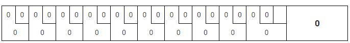

# BowlingGameKata
## Objectif du Kata
Le but de ce Kata est de simuler une partie du jeu de bowling et calculer son score. **TDD** (Test-Driven Developpement) doit être utilisé pendant l'implémentation du Kata.  

## Règle & Vocabulaires du jeu
- Une partie de bowling contient **10 carreaux** (ou **10 frames** en anglais)
- **2 boules** (ou 2 tires) à lancer pour chaque carreau
- Si 10 quilles sont tombés avec la première boule d'un carreau, il s'agit donc d'un **abat** (ou **strike** en anglais). Le 2ème tir ne sera pas accordé cas d'un abat
- Si 10 quilles sont tombées avec 2 boules consécutifs d'un carreau, on l'appelle une **réserve** (ou **spare** en anglais)
- Particulièrement pour le 10ème carreau : en cas d'Abat, 2 tirs complémentaires seront accordés, en cas de réserve, seulement 1 tir sera accordé      

## Calcul du score
- Score de base: Le nombre total de quilles battues pendant les carreaux (1 quille battue = 1 point)
- Bonus "Abat": il faut compter 10 points plus le nombre de quilles battues pour **les 2 prochain tirs**
- Bonus "Reserve" : il faut compter 10 points plus le nombre de quilles batturs pour **le prochain tir**
- Une partie "parfaite" : il s'agit de 12 abat consécutif qui apporte 300 points
- Voici un calculatrice qui calcule le score d'une partie: https://www.bowlinggenius.com/

## Exemple des parties
- **Exemple 1** : Un joueur n'a pas de bol, il a eu aucunne quille batue:

- **Exemple 2** : cette fois-ci, ce même joueur fait une progression :

- **Exemple 3** : il se progress encore pour avoir sa première réserve :

- **Exemple 4** : il continue à maitriser ce jeu de bowling avec son premier abat :

- **Exemple 5** : Enfin il est devenu le maitre du bowling avec finalement une partie parfaite

